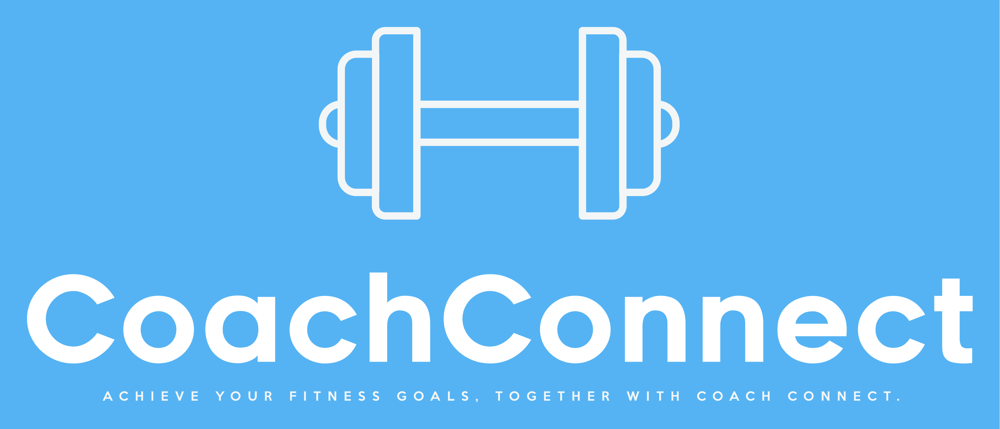

# Coach Connect

Coach Connect is a collaborative gym/fitness platform designed to facilitate seamless communication and collaboration between coaches and their clients. The platform provides a centralized hub for coaches and clients to interact, set goals, track progress, and share resources, ultimately enhancing the coaching experience and improving fitness outcomes.

## Features

- **Coach Frontend:** A dedicated frontend interface for coaches to manage their clients, create and assign workout plans, track progress, and communicate with clients.

- **Client Frontend:** A client-facing frontend that allows individuals to view their assigned workouts, track their progress, communicate with their coaches, and access resources shared by coaches.

- **API:** The CoachConnect API acts as the backend infrastructure, serving as the communication bridge between the frontend interfaces and the underlying database. It handles authentication, data retrieval, updates, and various other operations.

## Technologies Used

- **.NET C#:** The backend API and services are built using the .NET C# programming language, providing a robust and scalable foundation.

- **ASP.NET Core:** The web application framework used for building the API, providing powerful features for routing, authentication, and data manipulation.

- **Entity Framework Core:** The object-relational mapping (ORM) framework used to interact with the database, simplifying data access and manipulation.

- **SQL Server:** The chosen database management system, ensuring reliable storage and retrieval of data.

- **HTML, CSS, and JavaScript:** The client-facing frontends are built using these core web technologies to create interactive and engaging user interfaces.

## License

This project is licensed under the [MIT License](LICENSE). Feel free to use, modify, and distribute this codebase for personal or commercial purposes.

## Contact

If you have any questions, suggestions, or feedback, please don't hesitate to reach out. You can contact the project maintainer at [brandonjamesparkinson@gmail.com](mailto:brandonjamesparkinson@gmail.com) or open an issue in this repository.

